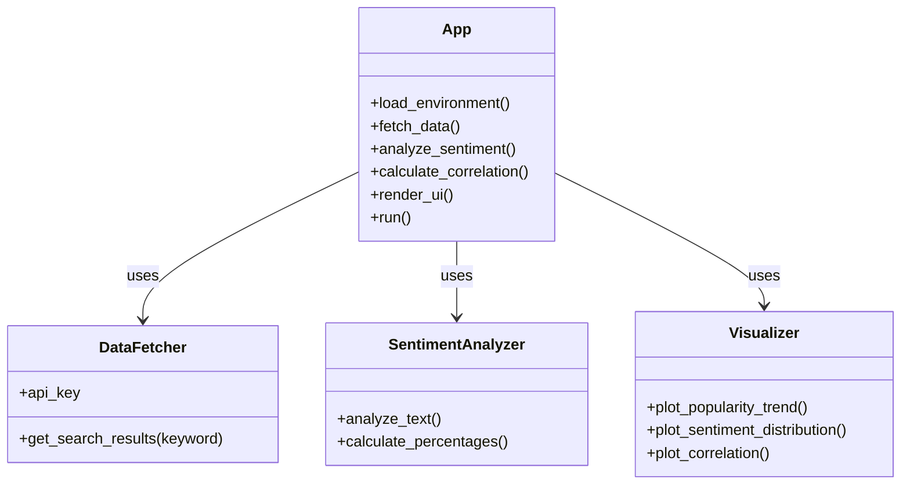

# Keyword Sentiment & Popularity Analyzer

A Streamlit-based web application that analyzes keyword popularity using search data and evaluates sentiment distribution. The project demonstrates API integration, data processing, sentiment analysis, correlation analysis, and data visualization in an interactive web interface.


## Project Structure



## Features

- **Keyword Analysis**: Fetches popularity data for user-input keywords  
- **Sentiment Classification**: Positive / Neutral / Negative categorization  
- **Correlation Analysis**: Measures relationship between popularity and positive sentiment  
- **Data Visualization**: Trend charts and sentiment distribution graphs  
- **Interactive UI**: Built with Streamlit  

## Requirements

- Python 3.8+
- Streamlit
- Pandas
- Matplotlib
- SerpAPI
- python-dotenv

## Installation

1. Clone the repository:
   ```
   git clone https://github.com/yourusername/your-repo-name.git
   cd your-repo-name
   ```

2. Install dependencies:
   ```
   pip install -r requirements.txt
   ```

3. Create a `.env` file in the root directory:
   ```
   SERPAPI_KEY=your_api_key_here
   ```

## How to Run

```
streamlit run app.py
```

## How It Works

1. User enters a keyword.  
2. Search trend data is fetched using SerpAPI.  
3. Sentiment analysis is performed on the retrieved data.  
4. Sentiment percentages are calculated.  
5. Correlation between popularity and positive sentiment is computed.  
6. Results are displayed through charts and tables.  

## Code Structure

- **DataFetcher**: Handles API communication  
- **SentimentAnalyzer**: Performs sentiment processing  
- **Visualizer**: Generates graphs  
- **App**: Controls UI flow and integrates components  

## Future Enhancements

- Multiple keyword comparison  
- Export results to CSV  
- Deploy on Streamlit Cloud  
- Improve sentiment model accuracy  

## License

This project is licensed under the MIT License.
